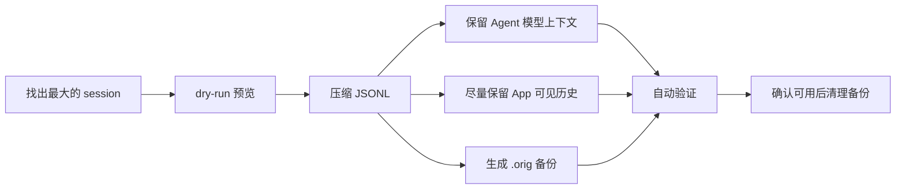

<div align="center">

# codex-session-compress

**Shrink oversized Codex session JSONL files while preserving Agent resume context.**

[](./CHANGELOG.md)
[](./pyproject.toml)
[](./LICENSE)
[](./pyproject.toml)

</div>

`codex-session-compress` 是一个用于管理本地 Codex 会话 JSONL 的 skill：找出最大的会话文件、压缩指定 session、验证压缩结果、清理已确认可用的备份，并可清理不再需要的已完成 SubAgent 会话。

它最重要的能力是：在已有 Codex full compaction checkpoint 的会话里，尽量缩小 JSONL，同时无损保留后续 Agent 继续工作所需的模型上下文。也就是说，压缩后的当前 session 仍应能被 Codex 继续打开、继续 resume，并保持 Agent 续作所需的语义基底。

## 安装

### 手动安装

推荐把源码克隆到一个固定目录，然后用软链接安装到 Codex skills 目录：

```bash
git clone https://github.com/chenjh16/codex-session-compress.git ~/codex-session-compress

CODEX_HOME_DIR="${CODEX_HOME:-$HOME/.codex}"
mkdir -p "$CODEX_HOME_DIR/skills"
ln -sfn "$HOME/codex-session-compress" "$CODEX_HOME_DIR/skills/codex-session-compress"
```

如果仓库已经存在，更新后重新链接即可：

```bash
cd ~/codex-session-compress
git pull

CODEX_HOME_DIR="${CODEX_HOME:-$HOME/.codex}"
mkdir -p "$CODEX_HOME_DIR/skills"
ln -sfn "$PWD" "$CODEX_HOME_DIR/skills/codex-session-compress"
```

### Agent + Prompt 自动安装

也可以把下面这段 prompt 发给 Codex Agent，让它自动安装：

```text
请将 https://github.com/chenjh16/codex-session-compress.git 安装为 Codex skill。

要求：
1. 克隆或更新仓库到 ~/codex-session-compress。
2. 使用软链接安装到 ${CODEX_HOME:-~/.codex}/skills/codex-session-compress。
3. 安装完成后读取 SKILL.md，确认 skill 名称为 codex-session-compress。
4. 不要复制真实 session JSONL，不要修改 ~/.codex/sessions。
```

## 快速开始

查看最大的会话：

```bash
python scripts/list_rollouts.py --top 20 --show-title
```

如果你的 Codex home 不在默认 `~/.codex`，先指定 `CODEX_HOME`：

```bash
CODEX_HOME=/path/to/codex-home python scripts/list_rollouts.py --top 20 --show-title
```

预览压缩某个 session：

```bash
python scripts/compress_session_by_id.py <session-id> --dry-run
```

执行压缩，默认目标大小是 `100MB`：

```bash
python scripts/compress_session_by_id.py <session-id>
```

指定目标大小：

```bash
python scripts/compress_session_by_id.py <session-id> --goal-size 500MB
```

确认压缩后的会话可正常打开和继续工作后，再清理 `.orig` 备份：

```bash
python scripts/cleanup_compression_backups.py <session-id> --apply --yes
```

## 核心功能

- 列出最大的 Codex session JSONL，并显示项目目录、session title、session id、文件大小和路径。
- 按 session id 自动定位并压缩 rollout JSONL。
- 主打模型上下文无损压缩：保留 Codex resume 后 Agent 继续工作所需的最新 checkpoint 和后续历史。
- 在目标大小允许时，尽量保留 Codex App / `codex resume` 可上翻的旧聊天记录。
- 压缩前保留 `.orig` 备份，压缩后自动执行静态验证和 Codex CLI/app-server 只读确认。
- 用户确认结果正常后，可以安全清理压缩备份。
- 可 dry-run 清理已完成且不再需要打开的 SubAgent 会话及其本地残留。

## 简单图示



## 保留策略概览

压缩时会优先保留两类内容：

1. **必须保留**：后续 Agent resume 所需的模型上下文基底，包括最新 full compacted checkpoint 和它之后的完整后续历史。脚本不会为了达到目标大小而裁剪这部分内容。
2. **尽量保留**：在 `GOAL_SIZE` 预算内，从旧历史两端尽量保留 Codex App 可见聊天记录和原始 raw breadcrumb。放不下的旧历史中段会被删除，并插入一条明确的 synthetic maintenance turn 说明这里发生过压缩。

如果 session 没有可验证的 full compacted checkpoint，脚本会拒绝压缩，并提示先在 Codex 中执行 `/compact`。

## 工具列表

- `list_rollouts.py`：按大小列出本地 Codex rollout JSONL，默认显示前 10 个。
- `compress_session_by_id.py`：通过 session ID 自动定位 rollout、压缩、验证，并保留备份。
- `cleanup_compression_backups.py`：在用户确认压缩结果正常后，dry-run 或删除 `rollout-*.jsonl.orig*` 压缩备份。
- `cleanup_session_by_id.py`：通过 root session ID 预览并清理已完成 SubAgent 及其 spawned descendants 的 rollout、索引和本地 SQLite 状态，默认创建 cleanup 备份，也支持用户明确确认后的直删模式。
- `restore_cleanup_manifest.py`：根据 cleanup manifest dry-run 或恢复一次已应用的 SubAgent 清理。
- `verify_rollout.py`：静态验证压缩后的 JSONL 是否保留必要 checkpoint、是否可安全加载。
- `confirm_session_with_codex_cli.py`：通过 `codex app-server --stdio` 的只读 `thread/read includeTurns=true` 确认压缩后会话可被 Codex CLI/App 重建。

## 背景

Codex 本地会话通常保存在：

```text
~/.codex/sessions/YYYY/MM/DD/rollout-<timestamp>-<session-id>.jsonl
```

长时间运行的会话可能因为图片、browser/computer-use 截图、大工具输出、重复 compacted 检查点而膨胀。桌面应用或 CLI 重新加载时可能出现内存暴涨、卡死、`RangeError: Invalid string length`、图片重放错误等问题。

本项目的目标不是无损保留所有旧 rollout 原始行，而是在 Codex 源码定义的 resume reconstruction 语义下，完整保留后续 Agent 模型上下文，同时把不再参与 active resume 的旧历史尽量瘦身，让会话重新可加载、可验证、可回滚。

## 功能

- 列出 `CODEX_HOME/sessions` 或 `~/.codex/sessions` 下最大的 rollout JSONL 文件。
- 支持用户指定 `--top N`，默认 10，`--top 0` 表示全部。
- 输出项目文件夹名、session ID、大小、修改时间、路径，可选输出完整 `cwd` 和 Codex App 风格标题。
- 标题查询只读取本地轻量元数据：优先 `session_index.jsonl.thread_name`；sub-agent 会话会优先用 SQLite `state_*.sqlite` 的 `threads.agent_nickname` 覆盖长 prompt；其它会话再用 `threads.title` 兜底。sub-agent 标题会加 `【Sub】` 前缀。
- 按 session ID 自动定位 rollout 文件。
- 压缩时先写出临时瘦身 JSONL，再把原文件 rename 为 `.orig` / `.orig.N`，最后把瘦身文件安装回原路径；默认不会额外复制一份多 GB 原文件。
- 使用语义优先压缩策略：
  1. 定位最新 full compacted checkpoint，即带 `replacement_history` 的 `compacted`。
  2. 完整保留第一条 `session_meta`、该 checkpoint、以及 checkpoint 之后的所有 rollout 行。
  3. 用 `GOAL_SIZE` 剩余预算，优先从旧历史两端交替保留 App 可重建聊天流所需的原始 `event_msg`，并把 checkpoint 前的 `turn_context` 放在同一 UI breadcrumb 优先级中尽量保留，让 Codex App 和 `codex resume` 在预算允许时仍可上翻旧聊天。
  4. 如果还有预算，再从旧历史两端交替保留原始 `response_item` breadcrumb，包括消息、reasoning、工具调用、工具输出和带图片的 response item。
  5. 用一个极小的显式 synthetic maintenance turn 表示被截去的历史中段；它由四条带顶层 `timestamp` 的合法 `RolloutLine` 组成：`event_msg.task_started`、`event_msg.user_message`、`event_msg.agent_message`、`event_msg.task_complete`。它会放在 checkpoint 前旧历史两端 breadcrumb 中间的真实截断位置。`user_message.client_id` 使用 `codex-session-compress-elision-` 前缀，并明确说明该用户气泡由压缩工具写入、不是原始用户指令；注入文案会优先按操作系统语言显示，中文系统用中文，其它语言默认英文。
- 如果没有 full compacted checkpoint，脚本会拒绝修改文件；请先在 Codex 中执行 `/compact`，让 rollout 产生可验证的 `replacement_history`。
- 压缩后自动运行 `verify_rollout.py`。
- 静态验证成功后，默认继续运行 `confirm_session_with_codex_cli.py`，通过 `codex app-server --stdio` 发起只读 `thread/read includeTurns=true`，确认 Codex 自己能重建该 thread history；如果压缩注入了 synthetic maintenance turn，还会要求可见 history 中同一个 reconstructed turn 同时存在 synthetic `userMessage` 和 synthetic `agentMessage`。
- 静态验证或 Codex CLI confirmation 失败时，默认把备份 rename 回原路径进行恢复。
- 可选运行 `codex resume <session-id>` 做交互式检查。
- 支持列出压缩备份；用户确认压缩结果正常后，用 `cleanup_compression_backups.py` 执行受保护的 dry-run / `--apply --yes` 删除。
- 支持 dry-run 优先清理已完成 SubAgent：默认只允许 `thread_spawn_edges.status = closed` 的 root 子会话，并沿 `thread_spawn_edges` 自动展开清理整棵 spawned subtree，删除匹配的 `rollout-*.jsonl`、`*.jsonl.zst`、可选 `.orig` 备份、`session_index.jsonl` 记录和相关 SQLite 状态。正式清理默认会先备份所有被触碰文件；如果用户明确说不用备份，可用 `--no-cleanup-backup` 直接清理。
- 清理会使用最新且实际提到 requested root 的 `state_*.sqlite` 作为 canonical cleanup source；其它 state DB 只做诊断，额外 descendants 会列为 stale candidates，不会静默进入 cleanup IDs。
- 清理时补齐 Codex `delete_threads_strict` 的 agent job 语义：如果 job runner 和 worker 都在 cleanup subtree，相关 pending/running `agent_jobs` 会标记为 `cancelled`，`agent_job_items.assigned_thread_id` 会清空。
- `repair_rollout.py`、`verify_rollout.py`、`compress_session_by_id.py` 支持 `--json`，便于新 Agent 批量判断；`compress_session_by_id.py --verify-only` 可只做严格 semantic verification。

## 安装说明

作为 skill 使用时，将整个目录放到你的 skills 目录，例如：

```bash
mkdir -p ~/.codex/skills
git clone https://github.com/chenjh16/codex-session-compress.git ~/.codex/skills/codex-session-compress
```

如果希望后续方便开发和更新，推荐使用前文的软链接安装方式，而不是直接复制。也可以手动复制本目录到：

```text
~/.codex/skills/codex-session-compress
```

本项目仅依赖 Python 标准库，建议 Python 3.8+。

## 快速使用

### 1. 查看最大的 Codex 会话 JSONL

```bash
python scripts/list_rollouts.py
python scripts/list_rollouts.py --top 25
python scripts/list_rollouts.py --top 0
python scripts/list_rollouts.py --show-cwd
python scripts/list_rollouts.py --show-title
```

示例输出字段：

```text
#    size  modified             session_id                            path
1  1.3GB   2026-05-20 09:12:00  MyProject  7f9f9a2e-...              ~/.codex/sessions/...
```

### 2. 预览压缩

```bash
python scripts/compress_session_by_id.py <session-id> --dry-run
```

### 3. 执行压缩

```bash
python scripts/compress_session_by_id.py <session-id>
```

默认目标大小是 100 MB。需要更激进或更保守可指定：

```bash
python scripts/compress_session_by_id.py <session-id> --goal-size 80MB
python scripts/compress_session_by_id.py <session-id> --goal-size 1GB
```

如果会话已经归档，可以显式追加扫描归档目录：

```bash
python scripts/compress_session_by_id.py <session-id> --include-archived --dry-run
```

只验证、不压缩：

```bash
python scripts/compress_session_by_id.py <session-id> --verify-only
python scripts/compress_session_by_id.py <session-id> --verify-only --json
```

自然语言中的“压到 80MB”“目标 1GB”应分别映射为 `--goal-size 80MB` 和 `--goal-size 1GB`。纯数字按 MiB 解释。

### 4. 自动 Codex CLI 确认与可选交互检查

实际压缩并通过 `verify_rollout.py` 后，`compress_session_by_id.py` 默认会自动执行：

```bash
python scripts/confirm_session_with_codex_cli.py <session-id> --require-synthetic-marker
```

这个检查会启动：

```bash
codex app-server --stdio
```

它会使用当前压缩目标对应的 Codex home：默认从 `--base` 的 `sessions` / `archived_sessions` 父目录推断，也可以用 `--codex-home PATH` 显式覆盖。然后只发送 `initialize` 和只读 `thread/read includeTurns=true`。确认脚本使用后台线程读取 stdout/stderr，不依赖 POSIX `select`，并避免 app-server 的 stderr 输出撑满管道。它不会发送 `thread/resume`、`turn/start` 或用户 prompt，因此不会追加新 turn，也不会消耗模型调用。对于含 synthetic 压缩标记的 rollout，它会确认 Codex 重建后的同一个可见 turn 中存在：

- `userMessage.clientId` 以 `codex-session-compress-elision-` 开头；
- `agentMessage` 文案中包含 `codex-session-compress`。

只有用户明确要求跳过时，才使用：

```bash
python scripts/compress_session_by_id.py <session-id> --skip-codex-cli-confirm
```

如果还想人工打开 TUI 做交互式检查，可以额外运行：

```bash
python scripts/compress_session_by_id.py <session-id> --codex-check resume
```

这会运行交互式命令：

```bash
codex resume <session-id>
```

不要在用户未确认前运行非交互 prompt 检查，因为那可能会追加新 turn 并消耗额度。

### 5. 清理备份

压缩成功后，备份会被保留，例如：

```text
rollout-....jsonl.orig
rollout-....jsonl.orig.1
```

压缩备份默认使用同一文件系统内的 rename，而不是 `copy2`。因此常规峰值磁盘占用约为“原文件备份 + 新压缩文件”，不会再多出一份完整原文件副本。如果显式使用 `--backup-dir`，该目录必须和 rollout 位于同一文件系统；否则脚本会拒绝执行，避免静默复制超大 JSONL。

查看备份：

```bash
python scripts/compress_session_by_id.py <session-id> --list-backups
```

确认会话可正常恢复后，用 dry-run 先查看将删除的备份：

```bash
python scripts/cleanup_compression_backups.py <session-id>
```

用户明确确认后执行删除：

```bash
python scripts/cleanup_compression_backups.py <session-id> --apply --yes
```

如果是一批 session 都已经确认正常，可以清理当前 `CODEX_HOME/sessions` 下所有压缩备份：

```bash
python scripts/cleanup_compression_backups.py --all --apply --yes
```

该脚本只会删除 sessions base 下的 `rollout-*.jsonl.orig*`，不会删除 active JSONL、cleanup manifest 或 SQLite 状态。

如果要手动恢复：

```bash
mv '/path/to/backup.orig' '/path/to/rollout.jsonl'
```

恢复前请关闭 Codex，避免进程仍持有旧会话状态。

### 6. 清理已完成 SubAgent

如果 SubAgent 的结论已经回填到父会话，且你不再需要打开这个子会话本身，可以按 root session ID 清理它的本地残留。脚本会按 Codex 删除 thread 的语义，自动展开并清理这个 root 下面的 spawned descendants。先 dry-run：

```bash
python scripts/cleanup_session_by_id.py <session-id>
```

确认计划无误后，关闭 Codex，再执行：

```bash
python scripts/cleanup_session_by_id.py <session-id> --apply --yes
```

如果用户明确确认“不用备份”或“直接清理”，可以跳过 cleanup 备份：

```bash
python scripts/cleanup_session_by_id.py <session-id> --apply --yes --no-cleanup-backup
```

默认只允许清理能识别为 SubAgent 且 SQLite `thread_spawn_edges.status = closed` 的显式请求 root session。这个状态只能说明本地 spawn edge 生命周期已关闭，不能证明结论已经完整回到父会话，所以仍需人工确认 dry-run 计划。dry-run 会输出 `requested_session_ids`、`descendant_session_ids`、最终 `session_ids`、canonical state DB，以及 secondary state DB 中只作诊断的 stale descendant candidates；脚本会删除 cleanup IDs 对应的 active/archived rollout、`*.jsonl.zst` 压缩 sibling、`.jsonl.orig` 备份（除非使用 `--no-rollout-backups`）、`session_index.jsonl` 中的名称记录，以及本地 SQLite 中匹配该 thread id 的 `threads`、`thread_dynamic_tools`、`thread_spawn_edges`、`agent_jobs`、`agent_job_items`、`logs`、`thread_goals`、`stage1_outputs` 记录或引用；`agent_job_items.assigned_thread_id` 会被清空而不是删除 job 行。

如果多个 `state_*.sqlite` 对显式请求的 root session 报告冲突的 spawn edge 状态，例如同时出现 `closed` 和 `open`，dry-run 会拒绝清理并在 `refused_status_conflict` 中列出来源。正式 `--apply` 前还会检测是否有 Codex App 或 `codex` CLI 进程看起来正在使用目标 Codex home；默认拒绝，只有明确接受风险时才使用 `--allow-running-codex`。脚本会尽量读取进程环境里的 `CODEX_HOME`；未声明 home 的 Codex 进程按默认 `~/.codex` 处理。

默认情况下，所有被删除或改写的文件会先备份到：

```text
<codex-home>/backups/session-cleanup-<UTC timestamp>/
```

结果中会输出 `cleanup-manifest.json` 路径和 SQLite `integrity_check` 结果。manifest 会记录 SQLite `-wal` / `-shm` sidecar 在清理前是否存在；如果清理失败并触发恢复，脚本会删除本次失败中新生成的 sidecar。

使用 `--no-cleanup-backup` 时，不会创建 `<codex-home>/backups/session-cleanup-*`，JSON 结果会显示 `cleanup_backup_enabled: false`，也不会有可供 `restore_cleanup_manifest.py` 使用的恢复 manifest。这个模式不可逆；脚本会先完成 SQLite 写入与 `PRAGMA integrity_check`，再删除 rollout 文件，避免数据库预检或写入失败时先删掉大 JSONL。

如果成功清理后需要回滚，先 dry-run，再确认恢复：

```bash
python scripts/restore_cleanup_manifest.py <cleanup-manifest.json>
python scripts/restore_cleanup_manifest.py <cleanup-manifest.json> --apply --yes
```

## 命令参考

### list_rollouts.py

```bash
python scripts/list_rollouts.py --help
```

常用参数：

- `--top N`：显示最大的 N 个，默认 10，0 表示全部。
- `--base PATH`：扫描目录，默认 `CODEX_HOME/sessions`（如果设置了 `CODEX_HOME`），否则为 `~/.codex/sessions`。
- `project`：默认显示 `session_meta.cwd` 的最后一级目录名，便于快速判断会话所属项目。
- `--show-cwd`：额外显示完整 `session_meta.cwd`。
- `--show-title`：显示 Codex App 风格标题。该功能只读 `session_index.jsonl` 和 SQLite 状态库，不扫描大 rollout 正文。
- `--title-source auto|session-index|sqlite|none`：标题来源，默认 `auto`，即普通会话优先 `session_index.jsonl`，缺失时用 SQLite 兜底；SubAgent 有 SQLite `agent_nickname` 时会优先显示该短名，避免显示长 first prompt。sub-agent 标题会显示为 `【Sub】<nickname-or-title>`。
- `--codex-home PATH`：标题元数据所在的 Codex home，默认优先使用 `--base` 的 `sessions` / `archived_sessions` 父目录，再回退到 `CODEX_HOME` 或 `~/.codex`。
- `--sqlite-home PATH`：SQLite 状态目录，默认读取 `sqlite_home` 配置、`CODEX_SQLITE_HOME` 或 Codex home。
- `--all-jsonl`：列出 base 目录下所有 `.jsonl`，不仅限 `rollout-*.jsonl`。
- `--json`：输出 JSON，便于脚本处理。

### repair_rollout.py

```bash
python scripts/repair_rollout.py --help
```

常用参数：

- `rollout`：直接传入要修复的 `rollout-*.jsonl` 路径。
- `--auto`：自动扫描 sessions 目录中超过目标大小的 rollout，并选择最大的一个。
- `--base PATH`：`--auto` 的扫描目录，默认 `CODEX_HOME/sessions`（如果设置了 `CODEX_HOME`），否则为 `~/.codex/sessions`。
- `--goal-size SIZE`：目标大小，默认 `100MB`。支持 `80MB`、`1GB`、`1.5GiB` 等。
- `--dry-run`：只预览，不修改文件。
- `--output PATH`：写出压缩副本，不替换原文件，也不创建备份。
- `--json`：输出 JSON 计划或结果，包含 checkpoint 行号、mandatory size、breadcrumb 保留/省略数量、物理省略的 checkpoint 前 rollout 行数和最终大小；和 `--auto` 同用时 stdout 仍保持纯 JSON。

### compress_session_by_id.py

```bash
python scripts/compress_session_by_id.py --help
```

常用参数：

- `--dry-run`：仅预览，不修改文件。
- `--goal-size SIZE`：目标大小，默认 `100MB`。
- `--backup-dir PATH`：备份目录，默认 rollout 所在目录；必须和 rollout 位于同一文件系统，以便使用 rename 归档原文件。
- `--scan-meta`：即使文件名未匹配，也扫描 `session_meta.id`。
- `--include-archived`：同时扫描 sessions sibling `archived_sessions`。
- `--verify-only`：只运行严格 semantic checkpoint 验证，不修改 rollout。
- `--force-semantic-verify`：即使文件已经小于 `--goal-size`，也在压缩流程后运行 semantic checkpoint 验证。
- `--skip-codex-cli-confirm`：跳过默认的 `codex app-server thread/read` 压缩后确认；只有用户明确要求时使用。
- `--codex-cli-confirm-timeout SECONDS`：Codex CLI confirmation 每个 app-server 响应的等待时间，默认 120 秒。
- `--codex-home PATH`：Codex CLI confirmation 和 `--codex-check resume` 使用的 Codex home；默认从 `--base` 的 `sessions` / `archived_sessions` 父目录推断，或回退到 `CODEX_HOME` / `~/.codex`。
- `--json`：输出 wrapper 级 JSON，包含 repair/verify/CLI confirmation 子结果。
- 当 rollout 超过 `--goal-size` 且实际执行了语义压缩时，压缩后的验证会要求保留 compacted/full compacted checkpoint，并启用 semantic checkpoint 验证；verifier 会要求 synthetic maintenance turn 是完整连续的 `task_started -> user_message -> agent_message -> task_complete` 四事件结构。随后默认运行 Codex CLI confirmation，确认 thread history 可重建，且 synthetic marker 已进入同一个可见 turn。
- `--list-backups`：列出该 session 对应的 `.orig` 备份路径。
- `--codex-check resume`：验证后运行交互式 `codex resume <session-id>`。
- `--no-auto-restore`：验证失败时不自动恢复备份。

### cleanup_compression_backups.py

```bash
python scripts/cleanup_compression_backups.py --help
```

常用参数：

- `<session-id>`：一个或多个要清理压缩备份的 session UUID。
- `--all`：清理 selected sessions base 下所有 `rollout-*.jsonl.orig*` 压缩备份。
- `--base PATH`：sessions base，默认 `CODEX_HOME/sessions` 或 `~/.codex/sessions`。
- `--include-archived`：同时扫描 `archived_sessions`。
- 默认是 dry-run，只打印计划。
- `--apply --yes`：真正删除备份，两个参数必须同时出现。
- `--json`：输出机器可读计划或结果。

### cleanup_session_by_id.py

```bash
python scripts/cleanup_session_by_id.py --help
```

常用参数：

- `<session-id>`：一个或多个要清理的 Codex root session UUID；脚本会自动加入 spawned descendants。
- 默认是 dry-run，只打印计划，不修改文件或数据库。
- `--apply --yes`：真正执行清理，两个参数必须同时出现。
- `--codex-home PATH`：Codex home，默认 `CODEX_HOME` 或 `~/.codex`。
- `--sqlite-home PATH`：SQLite 状态目录，默认读取 `sqlite_home` 配置、`CODEX_SQLITE_HOME` 或 Codex home。
- `--base PATH`：覆盖 rollout 扫描目录，默认扫描 `codex_home/sessions` 与 `codex_home/archived_sessions`。
- `--scan-meta`：当文件名不含 session ID 时，扫描 rollout 的 `session_meta.id`。
- `--no-rollout-backups`：不删除 `*.jsonl.orig` / `*.jsonl.zst.orig` 这类 rollout 备份。
- `--allow-open-subagent`：允许清理显式请求且 spawn edge 状态为 open 或 unknown 的 root SubAgent，仅在用户确认该子会话可丢时使用。descendants 会随允许的 root 一起清理。
- `--allow-non-subagent`：允许删除显式请求但未识别为 SubAgent 的普通 root session，仅在用户明确要求时使用。
- `--allow-running-codex`：允许在检测到目标 Codex home 可能仍被 Codex App / `codex` CLI 使用时执行清理，仅在用户明确接受风险时使用。
- `--backup-root PATH`：清理备份目录，默认 `codex_home/backups`。
- `--no-cleanup-backup`：不创建 cleanup 备份，直接清理文件和 SQLite 状态；不可用 `restore_cleanup_manifest.py` 回滚，只能在用户明确要求不用备份时使用。不能和 `--backup-root` 同时使用。
- `--vacuum`：删除 SQLite 行后运行 `VACUUM`。
- `--json`：输出机器可读计划或结果。

### restore_cleanup_manifest.py

```bash
python scripts/restore_cleanup_manifest.py --help
```

常用参数：

- `<cleanup-manifest.json>`：`cleanup_session_by_id.py --apply` 输出的 manifest。
- 默认是 dry-run，只展示将从哪些 backup 恢复到哪些 source。
- `--apply --yes`：真正执行恢复，两个参数必须同时出现。
- `--allow-running-codex`：允许在目标 Codex home 可能仍被 Codex App / `codex` CLI 使用时恢复，仅在用户明确接受风险时使用；目标 home 来自 manifest 中的 `plan.codex_home`。
- `--json`：输出机器可读计划或结果。

## 项目结构

```text
codex-session-compress/
├── AGENTS.md
├── SKILL.md
├── README.md
├── LICENSE
├── SECURITY.md
├── CONTRIBUTING.md
├── CHANGELOG.md
├── pyproject.toml
├── references/
│   ├── rollout-format.md
│   └── troubleshooting.md
└── scripts/
    ├── list_rollouts.py
    ├── compress_session_by_id.py
    ├── cleanup_compression_backups.py
    ├── cleanup_session_by_id.py
    ├── restore_cleanup_manifest.py
    ├── repair_rollout.py
    ├── verify_rollout.py
    └── confirm_session_with_codex_cli.py
```

## 安全声明

- 不要提交真实 `rollout-*.jsonl`、`.orig`、截图、日志或用户会话内容。
- 不要在未经用户确认的情况下删除备份；压缩备份清理使用 `cleanup_compression_backups.py`，并且正式删除必须显式使用 `--apply --yes`。
- 清理 SubAgent 前必须先 dry-run；正式删除必须显式使用 `--apply --yes`。
- 默认清理会创建 cleanup 备份；只有用户明确说不用备份或直接清理时，才可使用 `--no-cleanup-backup`。
- 默认只清理 `thread_spawn_edges.status = closed` 的 root SubAgent，并自动清理其 spawned descendants；清理 open/unknown root 子会话必须获得用户明确要求，并使用 `--allow-open-subagent`。
- 如果多个 state DB 对 root 的 spawn edge 状态互相冲突，不要强行清理；先人工确认本地状态。
- cleanup tree 只来自 canonical state DB；secondary state DB 里的额外 descendants 只作为诊断候选。
- 正式清理前默认要求目标 Codex home 未被 Codex 使用；不要随便使用 `--allow-running-codex`。
- 清理普通 root session 前必须获得用户明确要求，并使用 `--allow-non-subagent`。
- 执行 SubAgent 清理或恢复前建议关闭 Codex，避免进程持有旧文件或 SQLite 状态。
- 不要替换 checkpoint 之后 active suffix 中的图片或工具输出。
- 在 `GOAL_SIZE` 允许时，checkpoint 前保留下来的历史 breadcrumb 应优先保持原始 `event_msg`，并把 checkpoint 前 `turn_context` 放在同一 UI breadcrumb 优先级中尽量保留，以保留 App 可上翻聊天；剩余预算再保留原始 `response_item` 细节。
- 没有 full compacted checkpoint 时不要强行压缩；先让 Codex 生成 `replacement_history`。
- 如果验证失败，优先将备份 rename 回原路径恢复。
- 实际压缩后不要跳过 Codex CLI/app-server confirmation，除非用户明确要求。

## 许可证

MIT。
